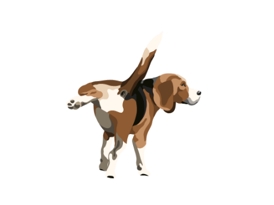

# Pawpal

Made by:
- Justus Boos
- Clara Goedecke
- Erik Lackmann
- Maurice Peplinski

Im Rahmen der HAW Veranstaltung *Software Engineering*

Link zu unserer Website:                              
- https://pawpal.azurewebsites.net/home             

English version below! (Thanks to GPT for translating)

*******************************************************************************
**Willkommen in dem Source Code zu unserem individuellem Hundeauswahl Erlebnis!**
*******************************************************************************

 **Voraussetzungen:**
  - Node.js v19.8.1
  - aktuelles JDK & JRE
  - Java IDE
  - Selenium im Gradle Builder (für die Java IDE)
  - Anderer Browser als Mozilla Firefox
  - Montserrat Font

*******************************************************************************
## Als Entwickler:

Die Software im Repo ist in zwei Teile geteilt. 
- Web Scraper
- Node.js Server basierte Website

Der Web Scraper muss aus dem Projekt Ordner rausgenommen werden, da er ausschließlich im Rahmen einer JAVA IDE funktioniert.
Mit dem Gradle Builder muss eine Java Anwendung mit der Selenium API gebuildet werden.
Hier können die Klassen im Ordner "DogScraperRebirth" reingelegt werden.

Der Server kann per folgendem Befehl im Terminal im Projektordnerverzeichnis gestartet werden:
  
  - node -e 'require(\"./app\").start()'

Die Website wird dann Lokal auf dem Port 3000 gehostet:

  - http://localhost:3000/home

Durch unsere Bemühungen im Rahmen der Continuous Integration und dem Continuous Deployment, wird die Software nach dem pushen oder mergen im Main Branch
automatisch getestet und nach einigen Minuten (Normalerweise unter 10 Min) im Web deployt. (URL s.o.)

********************************************************************************
## Als Nutzer:

Wir empfehlen zum Benutzen unserer Web Anwendung einen anderen Browser, als den Mozilla Firefox Browser.
Der Firefox Browser unterstützt ggf. einige unserer Formatierungen nicht!

1. Einfach die folgende Website besuchen:

  - https://pawpal.azurewebsites.net/home

2. Quiz abschließen:

   Mit dem Starten-Button gehts direkt los! Einfach alle fragen beantworten und das individuelle Ergebnis bekommen.
   (Falls nichts dabei rauskommt, wird dir im Zweifelsfall gesagt was du nochmal an deinen Wünschen ändern solltest)

3. Hunderassen Übersicht:

   Oben links ist unsere Übersicht per link zugänglich. Tob dich hier entweder mit der alphabetischen Filterung oder der
   Searchbar oben aus. Wir haben Informationen zu über 200 Hunderassen! Also für jeden den passenden Hund!

***************************************************************************************

# Pawpal

Link to our website:
https://pawpal.azurewebsites.net/home

*********************************************************************
**Welcome to the source code for our custom dog selection experience!**
*********************************************************************

**Requirements:**
- Node.js v19.8.1
- Current JDK & JRE
- Java IDE
- Selenium in Gradle Builder (for Java IDE)
- Different browser than Mozilla Firefox
- Montserrat Font

***************************************************************************************
## For Developers:

The software in the repository is divided into two parts.
- Web Scraper
- Node.js server-based website

The web scraper needs to be taken out of the project folder as it only works within a Java IDE.

The server can be started using the following command in the terminal within the project directory:

 - node -e 'require("./app").start()'

The website will then be hosted locally on port 3000:

 - http://localhost:3000/home

Thanks to our efforts in Continuous Integration and Continuous Deployment, the software is automatically 
tested and deployed on the web after pushing or merging into the main branch. 
It usually takes a few minutes (usually less than 10 minutes) for the deployment to happen. (URL mentioned above)

****************************************************************************************
## For Users:

We recommend using a browser other than Mozilla Firefox to use our web application.
Firefox browser may not support some of our formatting!

1. Simply visit the following website:
    
 - https://pawpal.azurewebsites.net/home
  

2. Complete the quiz:

    Click on the Start button to begin! Simply answer all the questions and get your personalized result.
    (If you don't get any results, you'll be provided with suggestions on what you should change according to your preferences)

3. Dog breeds overview:

    The overview is accessible through the link at the top left. Feel free to explore using the alphabetical filtering or the search bar at the top.
    We have information on over 200 dog breeds! So, there's a perfect dog for everyone!
